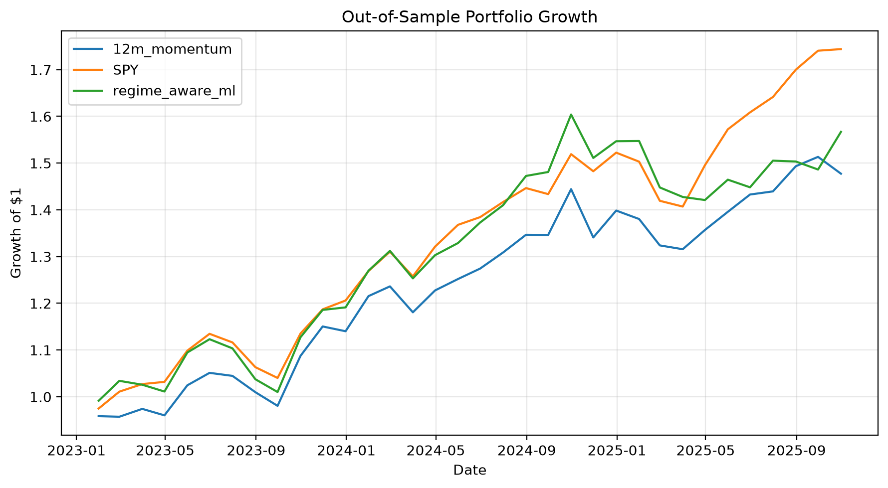

# Sector ETF Rotation with Machine Learning

A data science project investigating whether market, macroeconomic, and regime-aware features can improve U.S. sector ETF selection relative to simple momentum and SPY benchmarks.

This project is an independent extension of a graduate machine learning course project. The original binary-classification framework was rebuilt from raw data and expanded into a reproducible end-to-end pipeline with feature engineering, walk-forward validation, continuous excess-return prediction, cross-sectional ranking, regime-aware modeling, and transaction-cost sensitivity analysis.

## Research Question

Can machine learning improve next-month U.S. sector ETF selection relative to a simple momentum strategy and the broad U.S. equity market?

The analysis considers 10 sector ETFs:

- XLK — Technology
- XLF — Financials
- XLE — Energy
- XLV — Health Care
- XLY — Consumer Discretionary
- XLP — Consumer Staples
- XLI — Industrials
- XLU — Utilities
- XLB — Materials
- XLRE — Real Estate

SPY serves as the broad-market benchmark.

Each month, the final strategies rank the sector ETFs and select the top three for the following month.

## Project Overview

The project was developed in several stages:

1. Reconstruct the original market and macroeconomic dataset from raw sources.
2. Build reproducible preprocessing and feature-engineering pipelines.
3. Establish a logistic-regression classification baseline.
4. Evaluate models using expanding-window validation rather than random train-test splits.
5. Engineer additional market, cross-sectional, macroeconomic, and regime-aware features.
6. Reformulate the problem from binary classification to next-month excess-return prediction.
7. Compare machine-learning rankings with simple momentum strategies.
8. Reserve 2023–2025 as a held-out final test period.
9. Evaluate portfolio turnover and transaction-cost sensitivity.
10. Compare final strategies with SPY.

## Key Findings

The reconstructed original-style feature set showed limited stable predictive signal.

During expanding-window validation, logistic regression produced mean ROC-AUC near 0.50, and performance varied considerably across individual validation years.

Adding rolling market sensitivity, cross-sectional ranking, and other advanced market features produced only modest changes in classification performance.

Reformulating the target as continuous next-month excess return also failed to produce consistently strong sector rankings from the original feature set.

A simple 12-month momentum strategy became a stronger validation benchmark than the initial machine-learning approaches.

The final regime-aware Ridge model incorporated additional macroeconomic information and market-regime interactions. On the held-out 2023–2025 test period, it outperformed the 12-month momentum strategy in sector-ranking and portfolio performance.

However, neither active strategy outperformed SPY.

## Held-Out Test Results

The 2023–2025 period was not used for model selection or hyperparameter tuning.

| Strategy | Cumulative Return | Annualized Return | Annualized Volatility | Sharpe-like Ratio |
|---|---:|---:|---:|---:|
| SPY | **74.38%** | **21.69%** | **11.96%** | **1.81** |
| Regime-Aware Ridge | 56.68% | 17.17% | 14.49% | 1.18 |
| 12-Month Momentum | 47.73% | 14.77% | 13.34% | 1.11 |

The regime-aware Ridge strategy produced higher returns than the simple momentum benchmark, but SPY delivered both higher returns and stronger risk-adjusted performance over the same period.

The reported Sharpe-like ratio is calculated using annualized return divided by annualized volatility and assumes a zero risk-free rate.

## Ranking Performance

On the held-out test period, the regime-aware model also produced stronger cross-sectional rankings than the momentum benchmark.

| Strategy | Mean Spearman Rank Correlation | Median Spearman | Precision@3 |
|---|---:|---:|---:|
| Regime-Aware Ridge | **0.095** | **0.152** | **0.451** |
| 12-Month Momentum | 0.027 | 0.018 | 0.431 |

Although rank correlations remain modest, the regime-aware model showed stronger alignment between predicted and realized sector ordering during the final test period.

## Transaction-Cost Robustness

The regime-aware strategy traded more actively than the momentum strategy.

| Strategy | Mean Monthly Turnover | Median Turnover | Total Turnover |
|---|---:|---:|---:|
| 12-Month Momentum | 23.53% | 33.33% | 8.00 |
| Regime-Aware Ridge | 33.33% | 33.33% | 11.33 |

Turnover is approximated from changes in equal-weight top-three holdings. It does not fully account for weight drift within unchanged holdings.

The relative advantage of the regime-aware model over momentum remained under the tested transaction-cost assumptions:

| Strategy | 0 bps | 10 bps | 25 bps |
|---|---:|---:|---:|
| Regime-Aware Ridge | **56.68%** | **54.92%** | **52.32%** |
| 12-Month Momentum | 47.73% | 46.57% | 44.84% |

Transaction costs are applied per unit of estimated portfolio turnover.

## Out-of-Sample Portfolio Growth



The chart compares the growth of an initial $1 investment in:

- SPY
- the 12-month momentum strategy
- the regime-aware Ridge strategy

over the final held-out test period.

## Data Sources

### Market Data

Daily ETF and SPY market data are downloaded programmatically from Yahoo Finance using `yfinance`.

Market variables include:

- adjusted closing prices
- monthly returns
- momentum
- volatility
- drawdown
- rolling beta to SPY
- rolling correlation with SPY
- cross-sectional momentum ranks
- cross-sectional volatility ranks
- sector-return dispersion

### Macroeconomic Data

Macroeconomic data are downloaded programmatically from the Federal Reserve Economic Data (FRED) database.

Variables include:

- 10-year Treasury yield
- 2-year Treasury yield
- effective federal funds rate
- VIX
- 10Y–2Y yield spread
- Baa corporate credit spread
- WTI crude oil price
- CPI inflation
- unemployment rate
- monthly changes in macroeconomic variables

Publication-sensitive CPI and unemployment variables are lagged to reduce look-ahead bias.

Raw and processed datasets are excluded from GitHub and can be reconstructed using the scripts in `src/`.

## Feature Engineering

The project develops several groups of predictors.

### Sector Market Features

- 1-, 3-, 6-, and 12-month momentum
- 3-, 6-, and 12-month volatility
- 12-month drawdown

### SPY Features

Equivalent momentum, volatility, and drawdown features are constructed for SPY to represent the broader market environment.

### Relative and Cross-Sectional Features

- sector-minus-SPY momentum
- sector-minus-SPY volatility
- relative drawdown
- rolling sector beta to SPY
- rolling sector correlation with SPY
- momentum percentile ranks across sectors
- volatility percentile ranks across sectors
- cross-sectional sector-return dispersion

### Macroeconomic Features

- Treasury yields and yield-curve slope
- federal funds rate
- VIX
- corporate credit spread
- oil prices
- inflation
- unemployment
- monthly changes in these variables

### Regime Features

Binary regime indicators include:

- elevated VIX
- inverted yield curve
- rising interest rates
- widening credit spreads
- rising inflation
- rising unemployment

The final dataset also contains interactions between selected sector characteristics and macroeconomic regimes.

## Modeling Approach

### Binary Classification Baseline

The original formulation predicts whether a sector ETF will outperform SPY in the following month.

Logistic regression models were evaluated with:

- standard and balanced class weights
- L1 regularization
- L2 regularization
- chronological validation
- ROC-AUC
- balanced accuracy
- precision
- recall
- F1 score

The baseline feature representation produced limited stable out-of-sample classification signal.

### Continuous Excess-Return Ranking

The project was then reformulated around:

```text
next-month sector return − next-month SPY return
```

Rather than treating all positive and negative outcomes equally, the regression formulation retains the magnitude of sector outperformance or underperformance.

Ridge regression predicts next-month sector excess returns, and sectors are ranked by predicted values.

Evaluation includes:

- monthly Spearman rank correlation
- Precision@3
- average top-three excess return
- fraction of months the top-three basket beats SPY
- top-three performance relative to the sector universe

## Time-Aware Validation

Random train-test splitting is inappropriate for this financial time-series problem because it would allow future market environments to influence model development.

Model development therefore uses expanding-window validation:

```text
Train 2016–2018 → Validate 2019
Train 2016–2019 → Validate 2020
Train 2016–2020 → Validate 2021
Train 2016–2021 → Validate 2022
```

Preprocessing steps such as feature scaling are fitted independently within each training fold.

After model and strategy selection, the model is refitted using data available through 2022.

The 2023–2025 period is then evaluated once as the final held-out test set.

## Strategy Construction

### 12-Month Momentum Benchmark

At each month-end:

1. Rank sector ETFs by trailing 12-month momentum.
2. Select the top three sectors.
3. Allocate approximately one-third of the portfolio to each.
4. Hold for the following month.
5. Repeat monthly.

### Regime-Aware Ridge Strategy

At each month-end:

1. Construct market, macroeconomic, cross-sectional, and regime-aware predictors.
2. Use the fitted Ridge model to predict next-month excess return for each sector.
3. Rank sectors by predicted excess return.
4. Select the top three.
5. Equal-weight the selected sectors.
6. Hold for the following month.

## Repository Structure

```text
sector-etf-ml/
├── README.md
├── requirements.txt
├── .gitignore
│
├── data/
│   ├── README.md
│   ├── raw/
│   └── processed/
│
├── notebooks/
│   ├── 01_eda.ipynb
│   ├── 02_baseline_model.ipynb
│   ├── 03_advanced_features.ipynb
│   ├── 04_return_ranking.ipynb
│   ├── 05_regime_comparison.ipynb
│   ├── 06_final_test.ipynb
│   └── 07_backtest_robustness.ipynb
│
├── results/
│   ├── figures/
│   │   └── out_of_sample_growth.png
│   └── tables/
│       ├── final_performance.csv
│       ├── transaction_cost_sensitivity.csv
│       └── turnover_summary.csv
│
└── src/
    ├── download_data.py
    ├── download_macro_data.py
    ├── build_market_features.py
    ├── build_macro_features.py
    ├── build_model_panel.py
    ├── build_final_dataset.py
    ├── build_advanced_dataset.py
    └── build_regime_dataset.py
```

The raw and processed data directories are excluded from version control.

## Reproducing the Project

Clone the repository and install the required packages:

```bash
pip install -r requirements.txt
```

Run the data pipeline from the project root:

```bash
python src/download_data.py
python src/download_macro_data.py
python src/build_market_features.py
python src/build_macro_features.py
python src/build_model_panel.py
python src/build_final_dataset.py
python src/build_advanced_dataset.py
python src/build_regime_dataset.py
```

Then run the notebooks in numerical order:

```text
01_eda.ipynb
02_baseline_model.ipynb
03_advanced_features.ipynb
04_return_ranking.ipynb
05_regime_comparison.ipynb
06_final_test.ipynb
07_backtest_robustness.ipynb
```

## Tools and Libraries

The project uses:

- Python
- pandas
- NumPy
- scikit-learn
- statsmodels
- matplotlib
- yfinance
- pandas-datareader
- Jupyter

## Limitations

This project has several important limitations.

The universe contains only 10 sector ETFs, and the number of monthly observations is relatively small for machine-learning applications.

Financial relationships are nonstationary, and validation performance varied substantially across market periods.

Several macroeconomic series are observed or released at different frequencies. Lagged variables are used where appropriate, but a fully point-in-time macroeconomic database would provide more rigorous control over historical data availability and revisions.

The final expanded dataset contains slightly fewer observations than the original market-only dataset because observations with incomplete macroeconomic features are excluded.

The backtest assumes equal-weight monthly rebalancing and does not model:

- taxes
- bid-ask spreads
- market impact
- ETF tracking error
- execution delay
- exact drift-adjusted portfolio turnover

Transaction-cost scenarios should therefore be interpreted as sensitivity analyses rather than estimates of realized implementation costs.

Finally, the out-of-sample results cover only one historical test period. They should not be interpreted as evidence that the strategy will generate persistent future outperformance.

## Conclusion

This project demonstrates that increasing model complexity does not automatically improve financial prediction.

The original-style machine-learning baseline showed little stable predictive signal. A simple 12-month momentum rule provided a stronger validation benchmark, motivating a shift toward additional macroeconomic information and regime-aware modeling.

The final regime-aware Ridge model improved sector ranking and portfolio performance relative to the momentum benchmark on the held-out 2023–2025 test period, and its advantage remained under simplified transaction-cost assumptions.

However, SPY substantially outperformed both active strategies.

The result highlights the importance of strong benchmarks, leakage-aware validation, reproducible data pipelines, and reporting negative as well as positive findings when evaluating machine-learning strategies in financial markets.